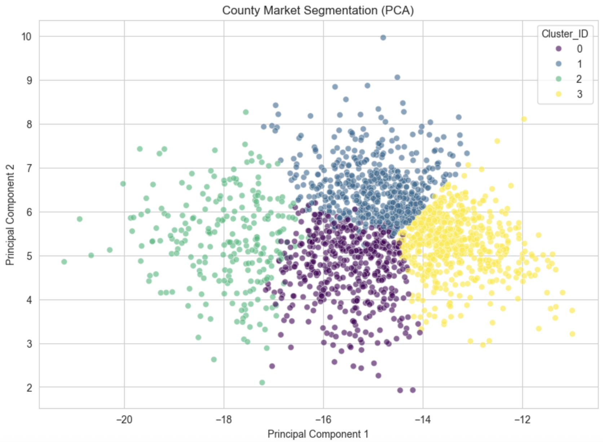
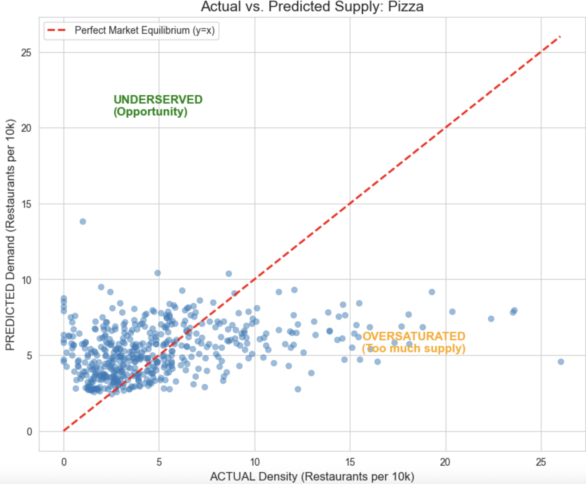

# Identifying Underserved Cuisine Markets Using Big Data

A big-data and machine-learning project that uses **Apache Spark** to identify U.S. counties where specific restaurant cuisines may be underserved. The pipeline combines restaurant supply from OpenStreetMap with demographic and food-environment data, groups comparable markets, predicts expected restaurant supply, and measures the difference between expected and actual supply.

**Authors:** Mahad Arshad and Wyatt Green  
**Course:** CSCI 3394 — Big Data & Machine Learning, Trinity University

## Project Highlights

- Processed a **2.2 GB OpenStreetMap dataset** containing approximately **476,000 food-related locations**.
- Integrated OpenStreetMap records with **U.S. Census / Food Environment** data and the **HUD ZIP-to-County Crosswalk**.
- Used **PySpark / Spark SQL** for ingestion, cleaning, key normalization, joins, feature engineering, and large-scale processing.
- Segmented comparable county markets with **K-Means clustering** and visualized the clusters with **PCA**.
- Trained **Random Forest regression** models for Pizza, Mexican, Coffee, and Chinese restaurant supply.
- Calculated a market-gap score from **predicted supply − actual supply** to surface potentially underserved markets.

## Pipeline

```text
OpenStreetMap restaurant data
            │
            ├── Clean ZIP/postcode values
            │
HUD ZIP-to-County Crosswalk
            │
            ├── Map ZIPs to county FIPS
            │
Census / Food Environment data
            │
            ▼
     Joined county dataset
            │
            ├── Clean numeric features
            ├── Log-transform skewed variables
            └── Standardize features
            │
            ▼
      K-Means clustering
            │
            ▼
  Random Forest regression
            │
            ▼
 Predicted supply - actual supply
            │
            ▼
     Cuisine market-gap ranking
```

## Market Segmentation

Counties are grouped into comparable market types before supply is modeled. The project evaluated multiple values of `k` and used four clusters for the final market segmentation.



## Supply Gap Analysis

For each cuisine, a Random Forest model estimates expected restaurant density per 10,000 residents. The project defines:

```text
Gap Score = Predicted Supply - Actual Supply
```

A positive gap indicates that the model estimates more restaurant supply than is currently observed, making the county a candidate for further market analysis. A negative gap indicates that observed supply exceeds the model estimate.



The analysis was run separately for:

- Pizza
- Mexican restaurants
- Coffee shops
- Chinese restaurants

## Tech Stack

`Python` · `Apache Spark 4.0` · `PySpark` · `Spark SQL` · `Spark ML` · `Apache Sedona` · `Pandas` · `NumPy` · `Matplotlib` · `Seaborn`

## Repository Structure

```text
.
├── README.md
├── underserved_cuisine_market_analysis.ipynb
├── requirements.txt
├── assets/
│   ├── actual_vs_predicted_pizza.png
│   └── county_market_segmentation_pca.png
├── data/
│   └── README.md
└── docs/
    └── project_report.pdf
```

## Running the Notebook

1. Clone the repository and create a Python environment.
2. Install the Python dependencies:

```bash
pip install -r requirements.txt
```

3. Download the three project datasets described in [`data/README.md`](data/README.md) and place them in the `data/` directory using the expected filenames.
4. Start Jupyter and run the notebook:

```bash
jupyter notebook underserved_cuisine_market_analysis.ipynb
```

The notebook initializes a local Spark session and downloads the configured Apache Sedona Spark package when needed.

## Methodology

### 1. Data integration
Restaurant records are cleaned and assigned standardized five-digit ZIP keys. The HUD crosswalk maps those ZIPs to county FIPS codes, which are then joined to county-level demographic and restaurant-supply data.

### 2. Feature preparation
Numeric demographic features are cleaned, log-transformed where appropriate, assembled into feature vectors, and standardized before clustering.

### 3. Market clustering
K-Means groups counties with similar demographic profiles so the regression stage compares markets with more similar characteristics rather than treating all counties as directly comparable.

### 4. Supply prediction
A Random Forest regressor estimates cuisine density using demographic features and the assigned market cluster. The data uses a 70/30 train-test split in the project notebook.

### 5. Gap ranking
Predicted cuisine density is compared with actual cuisine density. Positive deviations are ranked as potential underserved-market candidates for further investigation.

## Limitations

This project is an analytical prototype rather than a production site-selection system. Important limitations documented in the report include:

- OpenStreetMap is crowdsourced and may contain missing or incomplete restaurant records.
- ZIP codes and county boundaries are imperfect proxies for commercial trade areas.
- Cultural preferences and regional tastes are not directly modeled.
- A positive model gap should be treated as a signal for further analysis, not as a guarantee of business demand or profitability.

## Report

The complete project write-up is available in [`docs/project_report.pdf`](docs/project_report.pdf).
